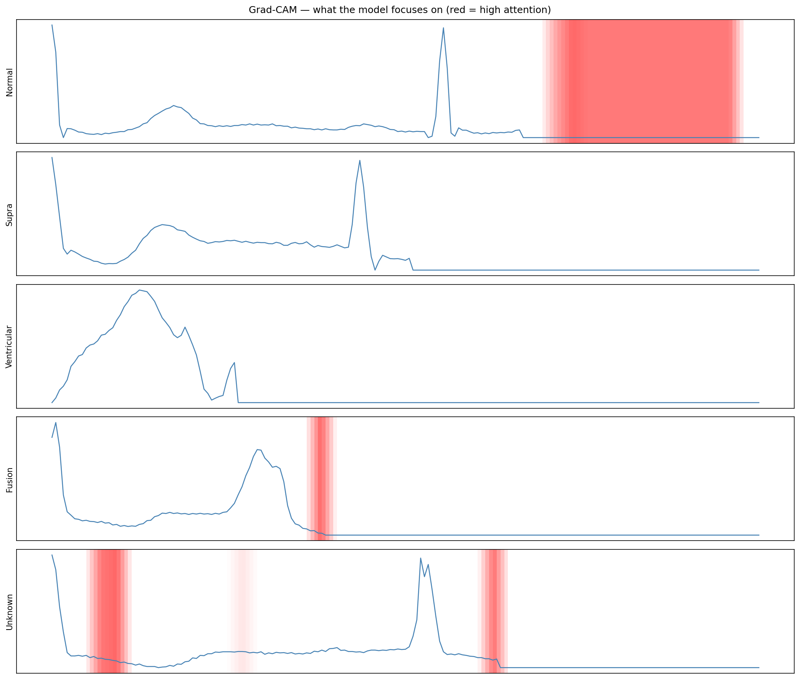

# ECG Heartbeat Classification with Deep Learning

Classifying cardiac arrhythmias from ECG signals using the [MIT-BIH dataset](https://www.kaggle.com/datasets/shayanfazeli/heartbeat).

## Results

| Model | Macro F1 |
|---|---|
| Random Forest (baseline) | 0.86 |
| 1D CNN + class weights | 0.90 |
| CNN + aggressive SMOTE | 0.83 |
| CNN + tuned SMOTE + Focal Loss | 0.93 |

Experiment tracking: [View on Weights & Biases](YOUR_WANDB_URL)

## Key Findings

- 1D CNN outperformed BiLSTM (macro F1: 0.90 vs 0.69) because ECG heartbeats
  are short sequences where local morphological features matter more than
  long-range dependencies
- Class weights alone outperformed aggressive SMOTE oversampling
- Tuned SMOTE (8k target) + Focal Loss achieved best results, improving
  Fusion F1 from 0.68 (baseline) to 0.84 — a 24% relative improvement
  on the hardest class

## What the model learned — Grad-CAM

Red regions show where the model focuses its attention for each class.
The model correctly learns to focus on the QRS complex and T wave regions.

## Tech Stack

- PyTorch — model training
- Scikit-learn — baseline and evaluation
- imbalanced-learn — SMOTE oversampling
- Weights & Biases — experiment tracking

## Skills demonstrated

1D CNN, Focal Loss, SMOTE, Imbalanced Classification,
Grad-CAM Explainability, Experiment Tracking, PyTorch
